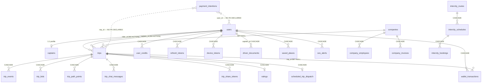

# 08 — Data Model, Migrations & Integrity

> Track: A — Foundation & safety-critical · Reviewer: chat-20260801-1214-a0bd · Date: 2026-08-01 (UTC)
> Base commit reviewed: `697f4347045e67bc488a9c91631d6497ab6511d7`

## 1. Scope

This document audits the D1 (SQLite) data model as a whole: the consolidated schema, foreign keys and
referential integrity, index coverage, money and timestamp column typing, enum discipline,
denormalisation, migration safety, retention and growth, D1 platform limits, and backup/restore.

Every citation resolves against base commit `697f4347`. All 19 migrations were applied to a local
SQLite database and the resulting schema — not the migration text — is the source of truth for every
structural claim below. Every behavioural claim marked `confirmed` was reproduced; the reproductions
are described inline so a reviewer can repeat them.

**Explicitly out of scope**, owned by sibling tracks:

| Not covered here | Owner |
|---|---|
| Wallet/ledger *business* correctness, double-entry design, reconciliation | T03 |
| PSP integration, Paymob webhook auth, payout rails | T04 |
| Pricing, surge and bidding economics | T05 |
| Dispatch and matching behaviour | T06 |
| Durable Object state (`TripRoom`, `GeoCell`, `CaptainInbox`, `OfferScheduler`) — DO storage is not D1 | T07 |
| Rider / captain app behaviour | T09 / T10 |
| Legal retention periods and regulatory obligations | T25 |
| Duplicated screens and cross-app drift | T27 |

Where the data model *causes* a problem those tracks will feel, it is recorded in §9 rather than fixed here.

This phase is review and plan only. No product code is changed by this PR.

## 2. What I actually read

**Migrations — all 19, read in full (836 lines).** `migrations/0001_init.sql` … `migrations/0019_trips_captain_status_index.sql`.
Applied end-to-end into a fresh SQLite database: **19/19 apply cleanly, producing 36 tables and 50
indexes** (excluding SQLite autoindexes). That database is the artefact every structural claim below
is derived from.

| File | Read for |
|---|---|
| `apps/api/src/index.ts` | Worker entrypoint, route mounting, and the `scheduled` cron handler — the source of the S1 in §4 |
| `apps/api/wrangler.toml` | Cron trigger definitions, D1/KV/R2/DO bindings |
| `apps/api/src/lib/schemas.ts` | Zod request schemas — the *only* enum enforcement that exists |
| `apps/api/src/lib/types.ts` | TypeScript row types; compared against real column types |
| `apps/api/src/lib/cleanup.ts` | Full read. The entire retention story, and a false premise in its header comment |
| `apps/api/src/lib/utils.ts` | `nowIso()` — one of the two timestamp producers |
| `apps/api/src/lib/audit.ts`, `notifications.ts` | Write paths into the two fastest-growing log tables |
| `apps/api/src/lib/nearby.ts` | Confirmed captain discovery runs through the GeoCell DO, not a D1 query — this is why one index is dead |
| `apps/api/src/routes/trips.ts` | Heaviest query site. Trip insert, status transitions, wallet debits, ratings |
| `apps/api/src/routes/admin.ts` | Second heaviest. Analytics aggregates, audit log, document review |
| `apps/api/src/routes/wallet.ts`, `payments.ts`, `intercity.ts`, `companies.ts` | Every write to `users.wallet_balance`, and the B2B billing surface |
| `apps/api/src/routes/captain.ts` | Location updates and path-point sampling; earnings queries |
| `apps/api/src/routes/auth.ts`, `user.ts`, `devices.ts`, `safety.ts`, `promo.ts`, `search.ts`, `geocode.ts` | Skimmed for writes to the tables under audit; read closely only where a query touched a table in scope |
| `apps/api/src/middleware/auth.ts`, `rateLimit.ts` | Skimmed — write paths into `turnstile_verifications` / `otp_codes` only |
| `scripts/check_migrations.py`, `scripts/check_migrations_apply.py` | Full read, and both executed |
| `apps/api/package.json`, `package.json` | `db:migrate` scripts; searched for any backup/export task |

**Read but not cited**: `lib/paymob.ts`, `lib/pricing.ts`, `lib/routing.ts`, `lib/geocode.ts`,
`lib/jwt.ts`, `lib/turnstile.ts` — reviewed for D1 writes, found none in scope.

**Not read**: the Flutter apps and the admin console. This track is the database; app-side coupling to
schema shape is noted in §9 for T09/T10/T11 rather than analysed here.

**External sources.** Cloudflare D1 documentation for foreign-key enforcement
(<https://developers.cloudflare.com/d1/sql-api/foreign-keys/>), platform limits
(<https://developers.cloudflare.com/d1/platform/limits/>), and Time Travel
(<https://developers.cloudflare.com/d1/reference/time-travel/>).

## 3. How it works today

### 3.1 The migration pipeline

Migrations are plain `.sql` files in `migrations/`, applied by Wrangler:

```
db:migrate:local   → wrangler d1 migrations apply <DB> --local
db:migrate:remote  → wrangler d1 migrations apply <DB> --remote
```

Wrangler tracks applied migrations in a `d1_migrations` bookkeeping table and applies each file once,
in filename order. There is no `down` direction — D1 offers none and the repository defines none.

Two home-grown checkers guard the directory, and both pass today:

- `scripts/check_migrations.py` — filename convention, contiguous numbering, UTF-8 validity, no empty
  files, no BOM, no mojibake in executable SQL (with `0014`/`0015` grandfathered). Output:
  `checked 19 migration(s) … check_migrations: OK`, with three grandfathered notes.
- `scripts/check_migrations_apply.py` — applies all 19 to a fresh in-memory database. Output:
  `applied 19/19 migration(s) to a fresh database / resulting schema: 36 table(s) / OK`.

Both verify that migrations work **on an empty database**. Neither tests re-application, and neither
inspects statement semantics. §4 and §6 turn on that gap.

### 3.2 The consolidated schema

This artefact did not exist before this document. Generated from the applied schema, not hand-written.

**36 tables · 50 indexes · 42 declared foreign keys · 22 CHECK constraints · 0 views · 0 triggers.**

Declared column types: **TEXT 264 · REAL 47 · INTEGER 31**.

| # | table | cols | grows | FK → parent |
|---|---|---|---|---|
| | **Identity & access** | | | |
| 1 | `users` | 13 | per user | **none** |
| 2 | `captains` | 25 | per captain | `user_id`→`users` |
| 3 | `refresh_tokens` | 6 | per session | `user_id`→`users` |
| 4 | `otp_codes` | 8 | per login | **none** |
| 5 | `turnstile_verifications` | 6 | per captcha check | **none** |
| 6 | `device_tokens` | 7 | per device | `user_id`→`users` |
| 7 | `driver_documents` | 12 | per upload | `reviewed_by`→`users`, `captain_id`→`users` |
| 8 | `document_types` | 9 | bounded / config | **none** |
| | **Trip lifecycle** | | | |
| 9 | `trips` | 46 | per trip | `company_id`→`companies`, `captain_id`→`users`, `rider_id`→`users` |
| 10 | `trip_events` | 6 | per status change | `trip_id`→`trips` |
| 11 | `trip_bids` | 6 | per bid | `captain_id`→`users`, `trip_id`→`trips` |
| 12 | `trip_chat_messages` | 7 | per message | `sender_id`→`users`, `trip_id`→`trips` |
| 13 | `trip_path_points` | 7 | per 30s of driving | `trip_id`→`trips` |
| 14 | `trip_promo` | 4 | per promo use | `promo_code`→`promo_codes`, `trip_id`→`trips` |
| 15 | `trip_share_tokens` | 6 | per share | `created_by`→`users`, `trip_id`→`trips` |
| 16 | `scheduled_trip_dispatch` | 5 | per scheduled trip | `trip_id`→`trips` |
| 17 | `ratings` | 7 | per rating | `to_user_id`→`users`, `from_user_id`→`users`, `trip_id`→`trips` |
| | **Money** | | | |
| 18 | `wallet_transactions` | 13 | per money movement | `trip_id`→`trips`, `user_id`→`users` |
| 19 | `payment_intentions` | 10 | per PSP checkout | **none** |
| 20 | `payment_methods` | 8 | per saved card | `user_id`→`users` |
| 21 | `user_credits` | 3 | per user | `user_id`→`users` |
| 22 | `promo_codes` | 8 | bounded / config | **none** |
| 23 | `referrals` | 7 | per referral | `referred_id`→`users`, `referrer_id`→`users` |
| 24 | `pricing_rules` | 9 | bounded / config | **none** |
| | **B2B & intercity** | | | |
| 25 | `companies` | 10 | bounded / config | **none** |
| 26 | `company_employees` | 9 | per employee | `user_id`→`users`, `company_id`→`companies` |
| 27 | `company_invoices` | 9 | per company per month | `company_id`→`companies` |
| 28 | `intercity_routes` | 9 | bounded / config | `vehicle_type_id`→`vehicle_types` |
| 29 | `intercity_schedules` | 8 | bounded / config | `captain_id`→`users`, `route_id`→`intercity_routes` |
| 30 | `intercity_bookings` | 12 | per seat booked | `rider_id`→`users`, `schedule_id`→`intercity_schedules` |
| | **Platform & ops** | | | |
| 31 | `audit_log` | 9 | per admin/money action | `actor_id`→`users` |
| 32 | `notification_log` | 11 | per push | `user_id`→`users` |
| 33 | `sos_alerts` | 10 | per SOS | `trip_id`→`trips`, `user_id`→`users` |
| 34 | `saved_places` | 7 | per saved place | `user_id`→`users` |
| 35 | `system_config` | 6 | bounded / config | `updated_by`→`users` |
| 36 | `vehicle_types` | 4 | bounded / config | **none** |

Column-level detail for the five tables the findings turn on:

**`trips`** — 46 columns

| column | type | null | default | ref |
|---|---|---|---|---|
| `id` 🔑 | TEXT | yes | — |  |
| `rider_id` | TEXT | no | — | → `users` *NO ACTION* |
| `captain_id` | TEXT | yes | — | → `users` *NO ACTION* |
| `status` | TEXT | no | `'searching'` |  |
| `city` | TEXT | no | `'cairo'` |  |
| `pickup_lat` | REAL | no | — |  |
| `pickup_lng` | REAL | no | — |  |
| `pickup_address` | TEXT | yes | — |  |
| `dropoff_lat` | REAL | no | — |  |
| `dropoff_lng` | REAL | no | — |  |
| `dropoff_address` | TEXT | yes | — |  |
| `distance_km` | REAL | yes | — |  |
| `duration_min` | REAL | yes | — |  |
| `currency` | TEXT | no | `'EGP'` |  |
| `estimated_fare` | REAL | yes | — |  |
| `final_fare` | REAL | yes | — |  |
| `commission` | REAL | yes | — |  |
| `payment_method` | TEXT | no | `'cash'` |  |
| `cancel_reason` | TEXT | yes | — |  |
| `captain_lat` | REAL | yes | — |  |
| `captain_lng` | REAL | yes | — |  |
| `created_at` | TEXT | no | `datetime('now')` |  |
| `assigned_at` | TEXT | yes | — |  |
| `arrived_at` | TEXT | yes | — |  |
| `started_at` | TEXT | yes | — |  |
| `completed_at` | TEXT | yes | — |  |
| `cancelled_at` | TEXT | yes | — |  |
| `updated_at` | TEXT | no | `datetime('now')` |  |
| `promo_code` | TEXT | yes | — |  |
| `discount` | REAL | yes | `0` |  |
| `vehicle_type_id` | TEXT | yes | — |  |
| `route_geometry` | TEXT | yes | — |  |
| `scheduled_for` | TEXT | yes | — |  |
| `schedule_status` | TEXT | yes | — |  |
| `waypoints` | TEXT | yes | — |  |
| `surge_multiplier` | REAL | no | `1.0` |  |
| `company_id` | TEXT | yes | — | → `companies` *SET NULL* |
| `cost_center` | TEXT | yes | — |  |
| `billed_to_company` | INTEGER | no | `0` |  |
| `offered_price` | REAL | yes | — |  |
| `accepted_price` | REAL | yes | — |  |
| `bidding_mode` | INTEGER | yes | `1` |  |
| `estimated_fare_piastres` | INTEGER | yes | — |  |
| `final_fare_piastres` | INTEGER | yes | — |  |
| `commission_piastres` | INTEGER | yes | — |  |
| `payment_status` | TEXT | no | `'unpaid'` |  |

**`users`** — 13 columns

| column | type | null | default | ref |
|---|---|---|---|---|
| `id` 🔑 | TEXT | yes | — |  |
| `email` | TEXT | no | — |  |
| `password_hash` | TEXT | yes | — |  |
| `name` | TEXT | yes | — |  |
| `phone` | TEXT | yes | — |  |
| `role` | TEXT | no | — |  |
| `status` | TEXT | no | `'active'` |  |
| `created_at` | TEXT | no | `datetime('now')` |  |
| `updated_at` | TEXT | no | `datetime('now')` |  |
| `wallet_balance` | REAL | no | `0` |  |
| `wallet_updated_at` | TEXT | yes | — |  |
| `wallet_balance_piastres` | INTEGER | yes | `0` |  |
| `avatar_url` | TEXT | yes | — |  |

**`wallet_transactions`** — 13 columns

| column | type | null | default | ref |
|---|---|---|---|---|
| `id` 🔑 | TEXT | yes | — |  |
| `user_id` | TEXT | no | — | → `users` *CASCADE* |
| `type` | TEXT | no | — |  |
| `direction` | TEXT | no | — |  |
| `amount` | REAL | no | — |  |
| `currency` | TEXT | no | `'EGP'` |  |
| `trip_id` | TEXT | yes | — | → `trips` *SET NULL* |
| `payment_ref` | TEXT | yes | — |  |
| `note` | TEXT | yes | — |  |
| `status` | TEXT | no | `'settled'` |  |
| `created_at` | TEXT | no | `datetime('now')` |  |
| `idempotency_key` | TEXT | yes | — |  |
| `amount_piastres` | INTEGER | yes | — |  |

**`payment_intentions`** — 10 columns

| column | type | null | default | ref |
|---|---|---|---|---|
| `id` 🔑 | TEXT | yes | — |  |
| `user_id` | TEXT | no | — |  |
| `order_id` | TEXT | no | — |  |
| `amount_piastres` | INTEGER | no | — |  |
| `currency` | TEXT | no | `'EGP'` |  |
| `purpose` | TEXT | no | `'wallet_topup'` |  |
| `trip_id` | TEXT | yes | — |  |
| `status` | TEXT | no | `'pending'` |  |
| `created_at` | TEXT | no | — |  |
| `settled_at` | TEXT | yes | — |  |

**`company_invoices`** — 9 columns

| column | type | null | default | ref |
|---|---|---|---|---|
| `id` 🔑 | TEXT | yes | — |  |
| `company_id` | TEXT | no | — | → `companies` *CASCADE* |
| `period_start` | TEXT | no | — |  |
| `period_end` | TEXT | no | — |  |
| `total_trips` | INTEGER | no | `0` |  |
| `total_amount` | REAL | no | `0` |  |
| `status` | TEXT | no | `'open'` |  |
| `paymob_order_id` | TEXT | yes | — |  |
| `created_at` | TEXT | no | `datetime('now')` |  |

### 3.3 Relationship graph



Dotted edges are relationships the code relies on that the schema does not declare.

**Nine tables declare no foreign key at all**: `users`, `companies`, `vehicle_types`, `pricing_rules`,
`promo_codes`, `document_types`, `otp_codes`, `turnstile_verifications`, **`payment_intentions`**.
The first six are roots or config and are correct to have none. `otp_codes` and
`turnstile_verifications` are short-lived anti-abuse logs where the omission is defensible.
`payment_intentions` is the exception that matters — see F-08-06.

**Are these constraints actually enforced?** The brief requires this be verified, not assumed. It is:
D1 enforces foreign keys by default, "identical to the behaviour you would observe when setting
`PRAGMA foreign_keys = on` in SQLite for every transaction", and because D1 runs every query inside an
implicit transaction a user query **cannot** turn it off — only `PRAGMA defer_foreign_keys` can defer
validation to the end of a transaction
(<https://developers.cloudflare.com/d1/sql-api/foreign-keys/>, `confirmed`).

This matters in both directions, and I verified both locally against `migrations/0001_init.sql`:

```
foreign_keys=OFF : INSERT trip with rider_id='GHOST_USER' → ACCEPTED  (plain SQLite default)
foreign_keys=ON  : INSERT trip with rider_id='GHOST_USER' → REJECTED: FOREIGN KEY constraint failed
```

So the 42 declared constraints are real protection in production, and the local `--local` development
database behaves the same way. The corollary is that the *undeclared* relationships are the entire
orphan surface. Eight `*_id` columns carry no foreign key:

| Column | Null? | Assessment |
|---|---|---|
| `payment_intentions.user_id` | NOT NULL | **Orphan risk on a money table** — F-08-06 |
| `payment_intentions.trip_id` | NULL | **Orphan risk on a money table** — F-08-06 |
| `payment_intentions.order_id` | NOT NULL | External Paymob reference; correctly not an FK |
| `trips.vehicle_type_id` | NULL | Orphan risk — a deleted vehicle type leaves trips pointing nowhere |
| `trip_events.actor_id` | NULL | Deliberate: actor may be the system, not a user |
| `audit_log.entity_id` | NULL | Polymorphic by design; cannot be an FK |
| `companies.tax_id` | NULL | External identifier, not a reference |
| `company_invoices.paymob_order_id` | NULL | External identifier, not a reference |

### 3.4 The two timestamp producers

Every timestamp column in the schema is `TEXT`. There is no `INTEGER` unix-epoch column and no real
date type — consistent, and a defensible choice for SQLite. The problem is not the type, it is that
**two different producers write two different formats into the same columns**:

| Producer | Where | Format | Example |
|---|---|---|---|
| SQL column default | `DEFAULT (datetime('now'))` on ~85 columns | `YYYY-MM-DD HH:MM:SS` | `2026-08-01 13:33:38` |
| Application | `nowIso()` (`lib/utils.ts:5`), **72 call sites** | `YYYY-MM-DDTHH:MM:SS.sssZ` | `2026-08-01T13:33:38.231Z` |

Both land in the same column. `trips.created_at` is a clean example: `INSERT INTO trips` at
`routes/trips.ts:442-450` does **not** list `created_at`, so it takes the SQL default and is stored in
space-separated form — while `trips.assigned_at`, `.completed_at` and `.updated_at` are bound from
`nowIso()` and stored in ISO form. Adjacent columns of the same table, in two formats.

This is only latent until something compares them. SQLite compares TEXT lexicographically, and
`' '` (0x20) sorts **before** `'T'` (0x54):

```
rows: sql-default='2026-08-01 12:00:00',  app-iso='2026-08-01T11:00:00.000Z'
ORDER BY ts            → [sql-default, app-iso]   ← app-iso is an hour EARLIER but sorts LAST
ORDER BY datetime(ts)  → [app-iso, sql-default]   ← correct
```

The codebase does it **both ways**: 8 sites normalise with `datetime()`
(`index.ts:346`, `admin.ts:30,78,79,91,117,165`, `companies.ts:234`) and 5 compare raw strings
(`index.ts:290`, `index.ts:361`, `captain.ts:283`, `companies.ts:176`, `companies.ts:193`).
When a single business operation uses one of each, it silently disagrees with itself. That is
exactly what F-08-01 is.

### 3.5 Money representation

Migration `0005_integer_currency_and_idempotency.sql` set out to move money from floating-point to
integer piastres. It added six `*_piastres` columns and backfilled them (`0005:15-19`). It never
removed the REAL columns, and the cutover was never completed. Today both representations exist and
**REAL is still the live one**:

| Column | Reads in `apps/**/*.ts` | Writes | Status |
|---|---|---|---|
| `users.wallet_balance` (REAL) | many | 8 sites | **live source of truth** |
| `users.wallet_balance_piastres` | **0** | 5 of those 8 | write-only mirror, diverges |
| `trips.estimated_fare_piastres` | **0** | **0** | dead since 0005 |
| `trips.final_fare_piastres` | **0** | **0** | dead since 0005 |
| `trips.commission_piastres` | **0** | **0** | dead since 0005 |
| `wallet_transactions.amount_piastres` | used | used | live on the PSP path only |
| `payment_intentions.amount_piastres` | used | used | live — the one table that is integer-only |

All eight write sites for `users.wallet_balance`:

| Site | Direction | Syncs `_piastres`? | Balance guard |
|---|---|---|---|
| `routes/intercity.ts:151` | debit | **no** | `wallet_balance >= ?` ✓ |
| `routes/intercity.ts:290` | credit | **no** | n/a |
| `routes/payments.ts:183` | credit | yes | n/a |
| `routes/payments.ts:273` | credit | yes | n/a |
| `routes/trips.ts:998` | debit | yes | `wallet_balance >= ?` ✓ |
| `routes/trips.ts:1030` | credit | yes | n/a |
| `routes/trips.ts:1049` | credit | yes | n/a |
| `routes/wallet.ts:114` | debit | **no** | `wallet_balance >= ?` ✓ |

All three debits are guarded — there is no overdraft hole here. But three of eight writes skip the
integer mirror, so `wallet_balance_piastres` drifts from `wallet_balance` on the intercity booking,
intercity refund and wallet withdrawal paths.

### 3.6 Enum discipline

22 CHECK constraints exist and cover 17 of the 31 enum-like columns. Fourteen accept any string:

`trips.status` · `trips.payment_status` · `trips.schedule_status` · `trips.payment_method` ·
`payment_intentions.status` · `referrals.status` · `referrals.reward_type` · `trip_events.type` ·
`driver_documents.type` · `payment_methods.type` · `otp_codes.role` · `device_tokens.app_role` ·
`audit_log.entity_type` · `intercity_bookings.payment_method`

Verified empirically against the migrated database:

```
INSERT INTO trips (... status ...) VALUES (..., 'TOTALLY_INVALID', ...)  → ACCEPTED
UPDATE trips SET payment_status = 'banana'                               → ACCEPTED
```

The real `trips.status` value set, from every write site:

| Value | Written at |
|---|---|
| `searching` | `trips.ts:442-450` (INSERT literal) and the column default |
| `offered` | `trips.ts:537`, `trips.ts:1177` |
| `assigned` | `trips.ts:862`, `trips.ts:1306` |
| `arrived` | `trips.ts:914` via `advanceStatus(c, "arrived", "arrived_at")` at `trips.ts:944` |
| `in_progress` | `trips.ts:914` via `advanceStatus(c, "in_progress", "started_at")` at `trips.ts:948` |
| `completed` | `trips.ts:974` |
| `cancelled` | `trips.ts:728` |

Seven states, none declared to the database. The only enforcement is Zod at the request boundary
(`lib/schemas.ts`) plus the `WHERE id = ? AND status IN (...)` guards on individual transitions
(e.g. `trips.ts:1307`). Any code path that writes a status without such a guard — including a future
migration or a manual `wrangler d1 execute` — can put a trip into a state no reader understands.

### 3.7 Retention today

`lib/cleanup.ts` is the entire retention story. It is invoked from the `scheduled` handler at
`index.ts:275`, gated by a `cleanup:last-run` KV key with a 24-hour TTL (`index.ts:273-277`), so
although the `*/1 * * * *` trigger calls it every minute it does real work roughly once a day.

It deletes from exactly two tables:

| Table | Predicate | Window | Site |
|---|---|---|---|
| `otp_codes` | `expires_at < datetime('now','-1 day')` | expiry + 1 day | `cleanup.ts:36` |
| `refresh_tokens` | `revoked_at < …'-7 days' OR expires_at < …'-7 days'` | +7 days | `cleanup.ts:49-52` |

Nothing else is ever deleted. `trip_path_points`, `audit_log`, `notification_log`, `trip_events`,
`trip_chat_messages`, `turnstile_verifications`, `wallet_transactions` and `company_invoices` all grow
without bound.

`turnstile_verifications` is a specific, documented mistake. `cleanup.ts:11-13` reads:

```
 * NOTE: `turnstile_verifications` does not exist in the current migrations
 * (0001–0010), so it is intentionally omitted here. If a later migration adds
 * it, purge rows older than 30 days the same way.
```

The table is created at `migrations/0003_global_transport.sql:201`, with an index at `:209`. It existed
three migrations *before* the range the comment claims to have checked. The omission has never been
deliberate — it rests on a factually wrong premise.

## 4. Findings

| ID | Sev | Finding | Evidence (`path:line`) | Impact | Confidence |
|---|---|---|---|---|---|
| F-08-01 | S1 | Monthly B2B invoice job runs on the every-minute cron **and** its SUM and its settling UPDATE disagree about timestamp format, so first-day trips are re-invoiced every minute | `apps/api/src/index.ts:267,336,344-346,361` | ~1,440 duplicate invoices per billing month; corporate customers over-billed | confirmed (reproduced) |
| F-08-20 | S1 | A **second** invoice generator exists at `companies.ts:167` with the mirror defect: it compares raw on both sides, so first-day trips are excluded from the SUM *and* never marked billed — silently under-billed, forever | `routes/companies.ts:170-171,176,193` | Revenue lost with no error; two uncoordinated generators can also both issue for one period | confirmed (reproduced) |
| F-08-02 | S1 | Two timestamp producers write two formats into the same TEXT columns; 5 sites compare them raw, 8 normalise | `lib/utils.ts:5`; `routes/trips.ts:442-450`; raw at `index.ts:290,361`, `captain.ts:283`, `companies.ts:176,193` | Silent wrong answers in billing, earnings and dispatch windows | confirmed (reproduced) |
| F-08-03 | S1 | Four highest-volume tables have no retention mechanism, against D1's **hard 10 GB ceiling that cannot be raised**; at the stated 10k trips/day target `trip_path_points` alone breaches it in ~6 months | `lib/cleanup.ts` (whole file); `routes/captain.ts:245`; <https://developers.cloudflare.com/d1/platform/limits/> | Platform hits an unraisable wall with no sharding or archival story | confirmed (limits + code); projection is an estimate |
| F-08-04 | S1 | No backup or restore capability beyond platform-default Time Travel. No export, no runbook, never rehearsed; restore is a destructive in-place overwrite | absence across `wrangler.toml`, `package.json`, `apps/api/package.json`, `scripts/`; <https://developers.cloudflare.com/d1/reference/time-travel/> | Unrehearsed recovery on a money-handling platform | confirmed |
| F-08-05 | S2 | `trips.status` — the core state machine — and 13 other enum columns have no CHECK constraint; arbitrary strings are accepted | `/tmp` reproduction; `migrations/0001_init.sql` (trips DDL) | A bad write puts a trip in a state no reader handles; no DB-level backstop | confirmed (reproduced) |
| F-08-06 | S2 | `payment_intentions`, the server-side source of truth for PSP crediting, declares **zero** foreign keys | `migrations/0011_payment_intentions.sql:8-19` | Orphan money rows survive user/trip deletion; no cascade, no integrity | confirmed |
| F-08-07 | S2 | The 0005 integer-currency migration was never finished: 3 piastres columns are dead, 1 is write-only, and 3 of 8 wallet writes skip the mirror | `migrations/0005:15-19`; `intercity.ts:151,290`; `wallet.ts:114` | The integer columns cannot be trusted for the eventual cutover | confirmed |
| F-08-08 | S2 | 12 of 19 migrations are non-idempotent and there is no rollback path of any kind | every bare `ALTER TABLE ADD COLUMN`, e.g. `0003:45`, `0004:16`, `0008:6`, `0015:10` | A half-applied migration must be hand-repaired against production | confirmed (tested) |
| F-08-09 | S2 | `cleanup.ts` skips `turnstile_verifications` on a false premise — the table has existed since 0003 | `lib/cleanup.ts:11-13` vs `migrations/0003_global_transport.sql:201` | An anti-abuse log grows forever because of a stale comment | confirmed |
| F-08-10 | S2 | `ratings` has no index on `to_user_id`; `driver_documents` has none on `status`. Both are full scans on live paths | `routes/trips.ts:1122`; `routes/admin.ts:633,646` | Rating writes and the admin review queue degrade linearly with table size | confirmed (EXPLAIN) |
| F-08-11 | S2 | Cron fan-out issues unbounded per-iteration queries against D1's per-invocation query cap | `index.ts:316` (no LIMIT), `index.ts:337-364` (3 queries × active company), `lib/notifications.ts:388` (no LIMIT) | Invoice run fails partway once company count grows; failure is caught and swallowed at `index.ts:369` | confirmed (code); threshold is an estimate |
| F-08-12 | S2 | `wallet_transactions.user_id` and `user_credits.user_id` are `ON DELETE CASCADE` to `users` — deleting a user destroys their financial ledger | FK dump from applied schema | **Latent today** (no delete path exists); becomes live with the first account-deletion feature | confirmed |
| F-08-13 | S3 | `idx_captains_city_online` is never used by any query, and sits on the highest-write table path | no `FROM captains … WHERE city` exists; discovery is `lib/nearby.ts` via GeoCell DO | Pure write cost on every captain heartbeat | confirmed (EXPLAIN + grep) |
| F-08-14 | S3 | Wallet history sorts in a temp B-tree on every page load | `routes/wallet.ts:26,46` | Avoidable per-request sort on a user-facing screen | confirmed (EXPLAIN) |
| F-08-15 | S3 | Admin analytics wrap `datetime()` around indexed columns, defeating range seeks | `routes/admin.ts:26,84,98` | Full index scans on the dashboard; worsens as `trips` grows | confirmed (EXPLAIN) |
| F-08-16 | S3 | 8 of 19 migrations mutate data, indistinguishable from schema migrations by name or metadata | `0001:117-133`, `0002:90-93`, `0005:15-19`, `0009:15`, `0014:29-37`, `0016:33-40`, `0017:19-32`, `0018:20` | Data fixes silently no-op on a diverged database and nobody notices | confirmed |
| F-08-17 | S3 | No consolidated schema document and no CI schema-drift check; the two checkers only prove a fresh apply works | `scripts/check_migrations*.py` | Schema knowledge lives only in 19 files nobody reads end to end | confirmed |
| F-08-18 | S4 | `idx_trips_captain` is superseded by 0019's `(captain_id, status)` composite for every read path | `migrations/0019:33` | Small redundant write cost | confirmed |
| F-08-19 | S4 | Index name `idx_wt_idem` is created in both 0005 and 0006 | `0005`, `0006` | Harmless (`IF NOT EXISTS`) but obscures history | confirmed |

---

### F-08-01 — The B2B invoice job bills the same trips 1,440 times (S1)

This is the most expensive defect in the data layer, and it is the product of two independent mistakes
that only become catastrophic together.

**Mistake one: the handler cannot tell which cron fired.** `wrangler.toml:62-65` declares two triggers:

```toml
crons = [
  "*/1 * * * *",  # every minute: dispatch due scheduled trips
  "0 3 1 * *",    # 1st of month 03:00 UTC: generate company invoices
]
```

Cloudflare passes the firing cron expression on the event. The handler discards it:

```ts
async scheduled(_event: ScheduledEvent, env: Env, ctx: ExecutionContext): Promise<void> {   // index.ts:267
```

`_event` is unused. Both triggers therefore execute the *entire* handler body, including the invoice
block. The only thing standing between the every-minute trigger and the monthly billing run is:

```ts
const day = new Date().getUTCDate();     // index.ts:335
if (day === 1) {                         // index.ts:336
```

On the 1st of the month that predicate is true for all 1,440 minutes.

**Mistake two: the SUM and the settling UPDATE use different comparison semantics.** The block is
written to be self-limiting: it sums unbilled trips, writes one invoice, then flips
`billed_to_company = 0` so the next run finds nothing. That safety depends on the two statements
selecting the *same rows*. They do not:

```ts
// index.ts:344-346 — SUM, timestamps normalised
`... FROM trips WHERE company_id = ? AND billed_to_company = 1
   AND datetime(created_at) >= datetime(?) AND datetime(created_at) < datetime(?)`

// index.ts:361 — settle, raw string comparison
`UPDATE trips SET billed_to_company = 0
   WHERE company_id = ? AND created_at >= ? AND created_at < ?`
```

Both are bound with `periodStart.toISOString()` / `periodEnd.toISOString()`
(`index.ts:348`, `index.ts:363`) — that is `2026-07-01T00:00:00.000Z`. But `trips.created_at` is
written by the **SQL default**, because `INSERT INTO trips` at `routes/trips.ts:442-450` does not list
the column — so it is stored as `2026-07-01 00:05:00`.

For a trip created on the first day of the period:

- SUM: `datetime('2026-07-01 00:05:00') >= datetime('2026-07-01T00:00:00.000Z')` → both normalise to
  the same shape → **true, counted**.
- UPDATE: `'2026-07-01 00:05:00' >= '2026-07-01T00:00:00.000Z'` → identical through `2026-07-01`, then
  `' '` (0x20) vs `'T'` (0x54) → **false, not cleared**.

Those trips stay `billed_to_company = 1`. Sixty seconds later the cron fires again, `day === 1` is
still true, the SUM still finds them, and another invoice is written.

**Reproduction.** Five trips for one company written in SQL-default format, then the two statements run
exactly as the code runs them:

```
index.ts:344-346  SUM  matches : ['t-aug01-0100','t-jul01-0005','t-jul01-2300','t-jul02','t-jul31']
index.ts:361      UPDATE clears: ['t-aug01-0100','t-jul02','t-jul31']
>>> counted-but-never-cleared : ['t-jul01-0005','t-jul01-2300']

simulating consecutive cron minutes:
invoice issued at minute -> trips on it: [(0,5),(1,2),(2,2),(3,2),(4,2),(5,2)]
```

One correct invoice, then a fresh duplicate every single minute. Over the 1,440 minutes of the 1st,
each company with any first-day trip receives on the order of 1,440 invoices, every one of them
re-billing the same trips. `company_invoices` gains ~1,440 rows per active company per month.

Note the failure is silent: the whole block is wrapped in `try/catch` that only logs
(`index.ts:368-370`), and `company_invoices.status` defaults to `'issued'`, so the duplicates look
like legitimate issued invoices.

**Why this is S1 and not S2:** it is wrong money, sent to paying corporate customers, generated
automatically, with no alert.

### F-08-20 — A second invoice generator, silently under-billing (S1)

`POST /companies/admin/:id/invoice` (`routes/companies.ts:167`) does the same job as the cron block,
in separate code, with different semantics and no shared helper. Its header comment says "admin
triggers manually or via cron".

Where the cron mismatches its two statements, this endpoint is internally *consistent* — and wrong in
both. Both the SUM (`companies.ts:176`) and the settling UPDATE (`companies.ts:193`) compare
`created_at` **raw** against ISO binds built at `:170-171`. Since `trips.created_at` is stored
space-separated, `'2026-07-01 00:05:00' >= '2026-07-01T00:00:00.000Z'` is **false** — so every trip
created on the first day of the period is invisible to both statements.

The consequence is the opposite of F-08-01 and worse in one respect: those trips are never invoiced,
and because the UPDATE also skips them they keep `billed_to_company = 1` while the billing window moves
past them. No later period will ever pick them up. The money is not double-charged; it is simply never
charged, and nothing logs it.

Reproduction, four July trips for one company at 100 EGP each:

```
trips actually in July       : 4 worth 400 EGP
companies.ts:174-176 invoices: 2 worth 200 EGP
>>> UNDER-BILLED             : 2 trips, 200 EGP silently dropped
rows the UPDATE at :193 clears: ['t-jul15','t-jul31']
```

Two further problems follow from there being two generators at all. They compute their period
differently — `companies.ts:170-171` uses `new Date(y, m-1, 1)` to `new Date(y, m, 1)` (a clean
calendar month), while `index.ts:340-341` uses `new Date(y, m-1, 1)` to **`new Date()`**, the current
instant, so the cron's period silently includes part of the current month. And with no unique
constraint on `(company_id, period_start)`, an admin pressing the button on the 1st while the cron is
running produces two invoices for the same period with different totals. P0.1's unique index closes
that; the duplicated logic should be collapsed into one function.

### F-08-02 — Two timestamp formats in one column (S1)

F-08-01 is the sharpest symptom; the disease is broader. ~85 TEXT timestamp columns carry
`DEFAULT (datetime('now'))`, and 72 call sites bind `nowIso()` instead. Which one wins depends on
whether a given INSERT happens to name the column.

The same table can hold both. `trips.created_at` is space-separated (SQL default) while
`trips.assigned_at`, `trips.completed_at` and `trips.updated_at` are ISO — so
`WHERE completed_at >= created_at` is not a safe comparison anywhere in this schema.

Four raw-comparison sites beyond the invoice bug are live today:

- `index.ts:290` — `d.scheduled_for <= ?` selects due scheduled trips. `scheduled_for` is app-written
  ISO and the bind is ISO, so this happens to be consistent **today**; it breaks the moment anything
  writes `scheduled_for` via a default or a manual SQL fix.
- `captain.ts:283` — captain earnings filters `completed_at` against bound ISO values. `completed_at`
  is ISO (written at `trips.ts:974` via `nowIso()`), so this is consistent today, for the same fragile
  reason.
- `companies.ts:176`, `companies.ts:193` — company trip listing and aggregation filter `created_at`
  raw, and `trips.created_at` is **space-separated**. Same class of mismatch as F-08-01.

The pattern is that correctness currently depends on remembering, per column, which producer wrote it.
That knowledge is nowhere in the schema and nowhere in the types — `lib/types.ts` declares these
columns as plain `string`.

### F-08-03 — Unbounded growth against a ceiling that cannot be raised (S1)

D1's published limits (<https://developers.cloudflare.com/d1/platform/limits/>):

| Limit | Free | Workers Paid |
|---|---|---|
| Maximum database size | 500 MB | **10 GB — cannot be increased** |
| Maximum storage per account | 5 GB | 1 TB |
| Query duration | 30 s | 30 s |
| Queries per Worker invocation | 50 | 1,000 |
| Time Travel retention | 7 days | 30 days |

Retention today covers two tables (§3.7). The four fastest-growing tables have no mechanism at all.

Projection at the brief's **1,000 trips/day** figure. Sampling is `confirmed` from
`routes/captain.ts:245` (`Date.now() - lastMs >= 30_000`); average trip duration of 20 minutes is an
**assumption**, giving 40 points/trip. Row widths are **estimates** from the real column types.

| Table | rows/day | rows/12 mo | est. bytes/row | est. size/12 mo |
|---|---|---|---|---|
| `trip_path_points` | 40,000 | 14,600,000 | ~150 B | **~2.1 GB** |
| `notification_log` | ~10,000 | 3,650,000 | ~450 B | ~1.6 GB |
| `audit_log` | ~8,000 | 2,920,000 | ~400 B | ~1.1 GB |
| `trip_events` | ~6,000 | 2,190,000 | ~250 B | ~0.5 GB |
| `wallet_transactions` | ~2,000 | 730,000 | ~300 B | ~0.2 GB |
| `turnstile_verifications` | ~500 | 182,500 | ~250 B | ~45 MB |
| **Total** | | | | **~5.6 GB / year** |

Arithmetic for the dominant line: `1,000 × 40 = 40,000/day`; `40,000 × 365 = 14.6M`;
`14.6M × 150 B ≈ 2.19 GB`.

At 1,000 trips/day the 10 GB ceiling arrives in roughly 21 months. **At the 10,000 trips/day figure the
brief asks us to benchmark against, `trip_path_points` alone produces ~21.9 GB/year and breaches the
cap in about 166 days** — with no sharding, no archival, and no way to buy more headroom.

Indexes are not counted above and add materially: `trip_path_points` carries `idx_path_trip_time`
over `(trip_id, recorded_at)`, so real consumption is higher than these figures.

### F-08-04 — There is no backup (S1)

Searched `wrangler.toml`, both `package.json` files, and `scripts/` for any export, dump, backup or
Time Travel reference. There are none. The only database scripts are `db:migrate:local` and
`db:migrate:remote`. No CI workflow files exist in the tree at all.

What exists is the platform default. D1 Time Travel is always on, needs no configuration, and allows
restore to any minute within 30 days on paid / 7 days on free
(<https://developers.cloudflare.com/d1/reference/time-travel/>). Restore is
`wrangler d1 time-travel restore <DB> --timestamp=<unix>`, which **overwrites the live database
in place** and cancels in-flight queries. There is no clone-to-a-copy option.

Honestly stated:

- **RPO** — up to the minute, but only within 30 days, and only by luck rather than design. Corruption
  discovered on day 31 is unrecoverable. Nothing has been chosen, tested or documented by this team.
- **RTO** — the platform operation itself is fast, but there is no runbook, nobody has rehearsed it,
  and the restore is destructive with no forward rollback except restoring to a newer bookmark.
  Realistically hours, dominated by deciding what to do rather than doing it.

For a platform that holds wallet balances this is a go-live blocker.

### F-08-05 — The core state machine has no database-level constraint (S2)

22 CHECK constraints exist; `trips.status` is not among them. Verified by insert (§3.6):
`'TOTALLY_INVALID'` and `payment_status = 'banana'` are both accepted.

The seven real states are enforced only by Zod at the boundary and by
`WHERE … AND status IN (...)` guards on individual transitions. The guards are good practice and
several exist (`trips.ts:1307`), but they protect a transition, not the column. `payment_status`,
which drives whether a rider is chased for money, has neither a CHECK nor a transition guard.

### F-08-06 — The PSP money table has no referential integrity (S2)

`migrations/0011_payment_intentions.sql:8-19` creates the table with `user_id TEXT NOT NULL` and
`trip_id TEXT` and declares no foreign keys, while the migration's own header (`0011:3-4`) describes
it as the "server-side source of truth so webhook crediting can verify amount + purpose before
touching the wallet".

Because D1 enforces declared FKs (§3.3), every other money-adjacent table is protected and this one is
not. A deleted user leaves payment intentions pointing at nothing; a deleted trip leaves `trip_id`
dangling. The idempotency guard that *does* exist — `order_id TEXT NOT NULL UNIQUE` (`0011:11`) — is
the reason this is S2 rather than S1: duplicate crediting is blocked even though referential
integrity is not.

### F-08-07 — The integer-currency migration is half-finished (S2)

Detailed in §3.5. Three columns (`trips.estimated_fare_piastres`, `.final_fare_piastres`,
`.commission_piastres`) have **zero** references anywhere in `apps/**/*.ts` — they were backfilled once
by `0005:15-19` and have been drifting from the REAL columns ever since, because every subsequent fare
write updates only the REAL side. `users.wallet_balance_piastres` is written by 5 of 8 sites and read
by none.

The practical consequence: when the team finally does the REAL→INTEGER cutover, **the piastres columns
cannot be used as the migration source.** They must be recomputed from the REAL columns, and the
divergence must be reconciled first. Every month that passes makes that reconciliation larger.

### F-08-08 — Non-idempotent migrations, and no way back (S2)

Tested by replaying each migration against a copy of the fully-migrated database. 7 are idempotent
(0001, 0006, 0007, 0014, 0016, 0017, 0019); **12 fail**, every one with `duplicate column name` from a
bare `ALTER TABLE … ADD COLUMN` — SQLite has no `ADD COLUMN IF NOT EXISTS`. Representative errors:
`duplicate column name: wallet_balance` (0003), `offered_price` (0004),
`rejection_reason` (0008), `first_name` (0015).

The team has already been bitten twice: `0006:4-6` documents removing an offending ALTER for
`otp_codes.attempts`, and `0007`'s body is now just `SELECT 1;` after the same problem with
`password_hash`. Both times the fix was to gut the migration rather than make it safe.

Separately, and reassuringly: **no migration would fail on a populated production table.** Every
`NOT NULL … ADD COLUMN` carries a `DEFAULT` (`0003:45,54,142`, `0005:22`, `0011:31`); the only unique
indexes are on tables created in the same migration or on a nullable column; there are no table
rebuilds; and there are **no destructive statements anywhere** — no `DROP TABLE`, no `DROP COLUMN`,
no `DELETE FROM`, and no `UPDATE` without a `WHERE`.

The rollback story is that there is none: no down migrations, no rollback scripts, no documented
procedure, and D1 provides no rollback command. Recovery from a bad migration means hand-written
compensating SQL against production, or the Time Travel restore that F-08-04 shows nobody has
rehearsed.

`needs-check`: whether D1 wraps each migration file in a transaction. No migration contains an
explicit `BEGIN`/`COMMIT`, so per-file atomicity is entirely D1's to provide. The comment at `0007`
about "aborting this migration and every migration queued after it" is consistent with per-file
atomicity but does not prove it, and the local harness (`check_migrations_apply.py`, which uses
`executescript()`) does **not** reproduce that behaviour — a mid-file failure there leaves a
half-applied schema. This should be confirmed against a real D1 instance before anyone relies on it.

### F-08-09 through F-08-12 (S2)

**F-08-09** — covered in §3.7. A one-line comment fix plus a `DELETE` is the entire remedy; the value
is that it removes an unbounded table from F-08-03's list.

**F-08-10** — `EXPLAIN QUERY PLAN` output, verbatim:

```
trips.ts:1122  SELECT AVG(score), COUNT(*) FROM ratings WHERE to_user_id = ?
               → SCAN ratings
admin.ts:633   SELECT COUNT(DISTINCT captain_id) FROM driver_documents WHERE status = ?
               → SCAN d
```

`ratings` has only its two autoindexes; there is no index on `to_user_id`. The scan runs on every
rating submission, and `ratings` grows once per completed trip.

**F-08-11** — the invoice loop issues three D1 queries per active company (`index.ts:343`, `:352`,
`:360`) inside a `for` over all active companies, and the dispatch loop runs
`SELECT id FROM users WHERE role = 'admin'` with **no LIMIT** (`index.ts:316`) once per due trip, then
calls `pushToUser`, which itself runs an unbounded `SELECT token FROM device_tokens WHERE user_id = ?`
(`lib/notifications.ts:388`). Against the 1,000-queries-per-invocation cap on Workers Paid, a few
hundred active companies is enough to hit the wall — and the resulting throw is swallowed by the
`catch` at `index.ts:368-370`, so a partially-generated billing run would look like a clean one.
The exact company count at which this trips is an **estimate**; the unbounded shape is `confirmed`.

**F-08-12** — `wallet_transactions.user_id` and `user_credits.user_id` are both `ON DELETE CASCADE` to
`users`. Deleting a user therefore erases their financial ledger. I searched the API and found **no
`DELETE FROM users` and no `DELETE FROM companies`** — the only deletes are `driver_documents`,
`saved_places`, `refresh_tokens`, `otp_codes`, `intercity_bookings`, `device_tokens` — so this is
latent, not live. Two things keep it latent: the absence of a delete endpoint, and the fact that
`trips.rider_id` is `ON DELETE NO ACTION`, which makes any user with trip history undeletable while
FK enforcement is on. It escalates to S1 the day an account-deletion or PDPL "right to erasure"
feature ships, which for a pre-production consumer app is a matter of when. `company_invoices` has the
same shape against `companies` (`CASCADE`).

## 5. Benchmark gap

The brief is explicit that Uber-scale is the wrong yardstick and "can this survive 10k trips/day on
D1" is the real question. So this section benchmarks the *practices*, not the scale.

**Schema as a maintained artefact.** Standard practice at any company past seed stage is a
single source-of-truth schema document regenerated in CI on every migration, so a drifted schema fails
the build. Synaptic Go has 19 migration files and, until this document, no consolidated view at all —
the schema existed only as something you could reconstruct by reading 836 lines in order. This is the
single cheapest gap to close and it is closed by a 40-line CI step.

**Migration linting.** Uber (schemaless/Docstore), Careem and effectively every payments-adjacent
company gate migrations on an automated linter that blocks destructive statements and
`NOT NULL`-without-default additions unless a human adds an explicit override. Synaptic Go's two
checkers verify that migrations apply to an *empty* database and nothing more. Credit where due: they
catch encoding and numbering problems that have genuinely bitten this repo (the mojibake grandfathering
in `check_migrations.py` is evidence of a real incident), so the instinct to automate is present — it
is just pointed at the wrong risks.

**Money representation.** Integer minor units are the universal standard: Stripe, Adyen, Paymob and
every ledger textbook. inDrive and Careem both settle in integer minor units. Synaptic Go *knows*
this — migration 0005 is titled `integer_currency` — but stopped halfway and left REAL as the live
representation. The gap is not knowledge, it is completion. Being pre-production is the advantage
here: the cutover is a migration and a code sweep, not a reconciliation project across live balances.

**Timestamp discipline.** The industry norm is one representation, enforced at one layer — usually
`TIMESTAMPTZ` in Postgres, or unix milliseconds in SQLite-backed systems. Storing ISO strings in TEXT
is defensible for D1 and sorts correctly *if the format is uniform*. Two formats in one column is not
a variant anyone practises; it is the specific failure mode that documentation warns about.

**Retention.** Uber tiers trip telemetry aggressively — hot storage for days, warm for weeks, cold
object storage thereafter — because GPS breadcrumbs dominate ride-hailing storage everywhere, exactly
as they do here. Synaptic Go keeps every breadcrumb forever in its primary transactional database. The
mechanism matters more than the policy: there is no tiering path at all, and D1's 10 GB cap makes one
mandatory rather than optional.

**Backup.** Any platform holding customer balances runs scheduled exports to separate storage with a
rehearsed restore. Synaptic Go relies on a platform default it never chose and has never tested. Note
this is *not* an argument that Time Travel is bad — it is genuinely good, and 30-day point-in-time
recovery beats many teams' nightly dumps. The gap is that nobody has confirmed it meets the
requirement, exported anything beyond its window, or practised a restore.

**Where Synaptic Go is genuinely ahead.** Worth saying plainly, because a review that only lists
failures is not calibrated:

- 42 foreign keys are declared and D1 enforces them. Many young codebases declare none.
- 22 CHECK constraints exist, including the full `wallet_transactions` type/direction/status triad.
- No destructive statement appears in any of the 19 migrations, and every `NOT NULL` addition carries
  a default — so no migration would fail on populated production data. That is better discipline than
  the non-idempotency suggests.
- `wallet_transactions` has a unique idempotency key, and `payment_intentions.order_id` is unique.
  The money paths were designed with replay in mind.
- All three wallet debits carry a `wallet_balance >= ?` guard. There is no overdraft hole.

The picture is a competent schema with an unfinished currency migration, an unguarded core enum, and
no operational story around growth or recovery.

## 6. Improvement plan

### P0.1 — Make the invoice cron fire once, and compare timestamps one way

- **Goal** — corporate customers receive exactly one correct invoice per month.
- **Design** — three independent fixes, because each alone is insufficient:
  1. Stop discarding the event. Replace `_event` with `event` at `index.ts:267` and branch on
     `event.cron`, so `"0 3 1 * *"` runs the invoice block and `"*/1 * * * *"` runs dispatch and
     cleanup. This alone stops the 1,440× multiplication.
  2. Make the SUM and the settling UPDATE use identical predicates. Normalise both with `datetime()`,
     or better, fix the data (P0.2) and compare raw on both sides. They must not differ.
  3. Add a real idempotency guard so a retry cannot double-issue:
     `UNIQUE(company_id, period_start)` on `company_invoices`, with `INSERT OR IGNORE`. This is the
     backstop that makes the other two failures survivable.
- **Files to change** — `apps/api/src/index.ts:267,333-370`, and `apps/api/src/routes/companies.ts:167-196`, which is the second generator from F-08-20. Collapse both into one exported `generateCompanyInvoice(env, companyId, periodStart, periodEnd)` so the period arithmetic and the comparison semantics exist in exactly one place; the cron and the admin endpoint both call it.
- **DB** — `migrations/0020_company_invoice_unique_period.sql`:
  ```sql
  -- de-duplicate before adding the constraint
  DELETE FROM company_invoices WHERE id NOT IN (
    SELECT MIN(id) FROM company_invoices GROUP BY company_id, period_start
  );
  CREATE UNIQUE INDEX IF NOT EXISTS idx_company_invoices_period
    ON company_invoices(company_id, period_start);
  ```
  Note this is a destructive data-fix migration and must be reviewed as such (see P1.2).
- **API contract** — none.
- **Effort** — S.
- **Risk** — the de-duplication `DELETE` is irreversible; take a Time Travel bookmark first and have a
  human eyeball the duplicate count. Rollback: restore the bookmark.
- **Acceptance criteria** — a simulated month with trips on the 1st produces exactly one invoice per
  company; re-running the handler produces zero additional rows; `billed_to_company` is 0 for every
  trip counted on the invoice; the invoice total equals the sum of *all* trips in the period,
  including those created on the first day; the cron and the admin endpoint produce byte-identical
  invoices for the same period.
- **Tests** — unit test over the cron branch asserting the invoice block does not execute for
  `event.cron === "*/1 * * * *"`; an integration test seeding first-day trips in SQL-default format
  and asserting a single invoice after 5 simulated ticks.

### P0.2 — One timestamp format, enforced

- **Goal** — every timestamp column holds one format, so raw comparison is always correct.
- **Design** — pick the SQL-default form `YYYY-MM-DD HH:MM:SS` (UTC). It is what the majority of
  columns already hold, it is what `datetime('now')` produces, it sorts lexicographically, and it
  keeps SQLite's date functions usable without conversion. Then: change `nowIso()` to emit that
  format, backfill existing ISO values, and add a test that fails if any timestamp column contains
  `'T'`.
- **Files to change** — `apps/api/src/lib/utils.ts:5` (the single producer — this is why the fix is
  cheap), then verify the 5 raw comparison sites (`index.ts:290,361`, `captain.ts:283`,
  `companies.ts:176,193`) and drop the now-unnecessary `datetime()` wrappers at the 8 normalised sites.
- **DB** — `migrations/0021_normalise_timestamps.sql`, one `UPDATE … SET col = REPLACE(SUBSTR(col,1,19),'T',' ')
  WHERE col LIKE '%T%'` per affected column. Pre-production row counts make this trivial to run.
- **API contract** — timestamps in JSON responses change shape. Confirm with T09/T10 whether either
  Flutter app parses them strictly; if so, format at the serialisation boundary instead of changing the
  wire format. **This is the one item here that is not purely internal.**
- **Effort** — M.
- **Risk** — a missed column keeps mixed data. Mitigate with the CI check below, which is the real
  deliverable.
- **Acceptance criteria** — a query over every TEXT timestamp column returns zero rows containing
  `'T'`; `nowIso()` and `datetime('now')` produce byte-identical shapes.
- **Tests** — a CI assertion over the applied schema that scans every timestamp column for `'T'`.

### P0.3 — Cap the four unbounded tables

- **Goal** — storage growth becomes a function of retention policy, not of time.
- **Design** — extend `runExpiredDataCleanup` with four deletes, each in its own try/catch matching
  the existing pattern, each `LIMIT`-batched so a single run cannot exceed the query-duration cap.
  Fix the false comment at `cleanup.ts:11-13` in the same change.
- **Files to change** — `apps/api/src/lib/cleanup.ts` (extend `CleanupResult`, add four deletes).
- **DB** — none for the deletes. One supporting index if `EXPLAIN` shows a scan on the path-point
  predicate.
- **API contract** — none.
- **Effort** — S.
- **Risk** — deleting data someone needs. Mitigated by conservative windows (below) and by shipping
  P1.4 (archival) before the windows tighten. Path points older than 90 days have no operational
  consumer; confirm with T12 that no safety/dispute flow reads them.
- **Acceptance criteria** — after one run, no row older than its window survives in the four tables;
  the audit row written by cleanup reports non-zero counts.
- **Tests** — seed rows either side of each boundary; assert exactly the old ones are removed.

**Proposed retention policy.** Rows marked ⚖️ have legal/financial retention implications and must be
agreed with **T25** before any deletion ships.

| Table | Retain | Mechanism | Note |
|---|---|---|---|
| `otp_codes` | expiry + 1 day | `cleanup.ts:36` (exists) | adequate |
| `refresh_tokens` | +7 days | `cleanup.ts:49-52` (exists) | adequate |
| `trip_path_points` | 90 days after trip end | add to cleanup | dominant consumer; no legal hold known |
| `turnstile_verifications` | 30 days | add to cleanup | fixes F-08-09 |
| `notification_log` | 90 days | add to cleanup | delivery-debug window |
| `device_tokens` | 90 days after `last_seen_at` | add to cleanup | stale tokens also waste FCM calls |
| `trip_events` | 1 year | add to cleanup (P1) | operational history |
| `trip_chat_messages` | 1 year | add to cleanup (P1) | ⚖️ may be needed for dispute/safety — T12 + T25 |
| `sos_alerts` | 5 years | manual / legal hold | ⚖️ safety records — T25 |
| `audit_log` | 1 year hot, then archive | archive to R2, then delete | ⚖️ T25 |
| `wallet_transactions` | 2 years hot, then archive | archive to R2, then delete | ⚖️ **never delete without archive** — T03 + T25 |
| `company_invoices` | 3 years hot, then archive | archive to R2, then delete | ⚖️ T25 |
| `trips` | 3 years hot, then summary archive | archive to R2 | ⚖️ trip receipts are financial records — T25 |

### P0.4 — A backup you have actually tested

- **Goal** — a known RPO/RTO, written down and rehearsed.
- **Design** — two parts, and the second is the one that matters. (a) A scheduled export of the
  financial tables (`wallet_transactions`, `company_invoices`, `payment_intentions`, `trips`) to R2 via
  the D1 REST export API, retained 12 months — this covers the gap beyond Time Travel's 30 days.
  (b) A restore runbook in `docs/RUNBOOK_RESTORE.md`, **rehearsed once against a scratch database**,
  recording the actual measured RTO. An untested backup is not a backup.
- **Files to change** — new `scripts/export_d1_to_r2.py`; new `docs/RUNBOOK_RESTORE.md`. CI YAML goes
  in `docs/plan/assets/08-backup-export.yml.txt`, not in `.github/workflows/`.
- **DB** — none.
- **Effort** — M.
- **Risk** — export credentials become a new secret to manage; scope the API token to D1 read only.
- **Acceptance criteria** — an export artefact exists in R2 with a verifiable row count; the runbook
  has a completed rehearsal entry with a real timestamp and a measured duration.
- **Tests** — restore rehearsal on a scratch database, documented.

### P1.1 — Constrain the enums, starting with `trips.status`

- **Goal** — the database rejects a state no reader understands.
- **Design** — SQLite cannot add a CHECK to an existing table without a rebuild, and a rebuild of
  `trips` is exactly the kind of migration this codebase has never done and has no rollback for. So
  do it in two steps: first add the constraint to the *tables that are cheap* and add a
  `BEFORE UPDATE` trigger on `trips.status` that raises on an unknown value; schedule the `trips`
  rebuild for P2 when the migration linter and backup rehearsal are both in place.
- **Files to change** — none (DB only).
- **DB** — `migrations/0022_status_guards.sql`:
  ```sql
  CREATE TRIGGER IF NOT EXISTS trg_trips_status_valid
  BEFORE UPDATE OF status ON trips
  WHEN NEW.status NOT IN ('searching','offered','assigned','arrived','in_progress','completed','cancelled')
  BEGIN SELECT RAISE(ABORT, 'invalid trips.status'); END;
  ```
  plus the matching `BEFORE INSERT` trigger and the same pattern for `trips.payment_status`
  (`unpaid`, `paid`, `refunded` — confirm the full set with T03/T04 first).
- **API contract** — none.
- **Effort** — S.
- **Risk** — a legitimate state written by a path I did not find would now abort. Mitigate by running
  a `SELECT DISTINCT status FROM trips` against production first and reconciling against the seven
  values in §3.6.
- **Acceptance criteria** — writing an unknown status fails; all seven known transitions still pass
  the integration suite.
- **Tests** — one test per known status plus one asserting rejection of an unknown value.

### P1.2 — A migration linter that blocks what the checkers miss

- **Goal** — the class of defect in F-08-08 and F-08-16 cannot reach `main`.
- **Design** — extend `scripts/check_migrations.py` with statement-level rules. Each is a checkable
  condition, and each maps to something this repo has actually done or narrowly avoided:

  | Rule | Condition | Severity |
  |---|---|---|
  | 1 | `ADD COLUMN … NOT NULL` without `DEFAULT` | error |
  | 2 | `UPDATE` with no `WHERE` | error |
  | 3 | `DELETE FROM` with no `WHERE` | error |
  | 4 | `DROP TABLE` / `DROP COLUMN` without an `-- allow-destructive:` override comment | error |
  | 5 | `CREATE UNIQUE INDEX` on a pre-existing table without an override | error |
  | 6 | file contains `UPDATE`/`DELETE` but no `-- data-fix:` or `-- backfill:` header | warning |
  | 7 | bare `ALTER TABLE ADD COLUMN` — flag as one-shot, require acknowledgement | warning |
  | 8 | index name already created by an earlier migration (F-08-19) | warning |

- **Files to change** — `scripts/check_migrations.py`; add a `-- data-fix:` header to the 8 migrations
  identified in F-08-16 so the new rule passes on existing files.
- **DB** — none. **Effort** — M. **Risk** — false positives on legitimate migrations; every rule has
  an explicit override comment, so the escape hatch is a code-review conversation rather than a block.
- **Acceptance criteria** — a deliberately bad migration (NOT NULL, no default) fails CI; all 19
  existing migrations pass.
- **Tests** — fixture migrations, one per rule, asserted to fail.

### P1.3 — Close the index gaps

- **Goal** — no full table scan on a path that grows with trips or users.
- **Design** — add the four indexes below and drop one dead one. Plans below are verbatim
  `EXPLAIN QUERY PLAN` output before and after, measured against the migrated database.
- **DB** — `migrations/0023_index_coverage.sql`:
  ```sql
  -- F-08-10: SCAN ratings → SEARCH, on every rating write
  CREATE INDEX IF NOT EXISTS idx_ratings_to_user ON ratings(to_user_id);

  -- F-08-10: SCAN driver_documents → SEARCH, admin review queue
  CREATE INDEX IF NOT EXISTS idx_docs_status ON driver_documents(status, captain_id);

  -- F-08-14: removes USE TEMP B-TREE FOR ORDER BY on the wallet history screen
  CREATE INDEX IF NOT EXISTS idx_wt_user_created ON wallet_transactions(user_id, created_at DESC);

  -- SCAN captains → SEARCH on the admin dashboard counters
  CREATE INDEX IF NOT EXISTS idx_captains_approval_status ON captains(approval_status);

  -- bounds the completed_at range for captain earnings (captain.ts:278, wallet.ts:75)
  CREATE INDEX IF NOT EXISTS idx_trips_captain_status_completed
    ON trips(captain_id, status, completed_at);

  -- F-08-13: no query filters captains by city; costs a write on every heartbeat
  DROP INDEX IF EXISTS idx_captains_city_online;
  ```
- **Files to change** — none for the indexes. Separately, `admin.ts:26,84,98` should drop the
  `datetime()` wrapper around indexed columns (F-08-15) — stored values sort correctly as strings
  **once P0.2 has normalised them**, so this must land after P0.2, not before.
- **Effort** — S. **Risk** — each index adds write cost; all five are on tables written far less often
  than read, except `trips(captain_id,status,completed_at)` which adds one entry per trip completion.
  Dropping `idx_captains_city_online` is safe — grep confirms no query uses `captains.city`, and
  discovery runs through the GeoCell DO (`lib/nearby.ts`).
- **Acceptance criteria** — `EXPLAIN QUERY PLAN` for each of the six queries shows `SEARCH … USING
  INDEX` with no `SCAN` and no temp B-tree.
- **Tests** — a CI assertion running `EXPLAIN QUERY PLAN` over the known hot queries and failing on
  `SCAN`.

### P1.4 — Archive before the retention windows tighten

- **Goal** — the ⚖️ tables can be deleted from D1 without losing anything.
- **Design** — monthly job exporting closed-period financial rows to R2 as newline-delimited JSON,
  partitioned by month, verified by row count, before any delete touches them. Depends on P0.4's
  export plumbing.
- **Effort** — M. **Risk** — an archive that is never read is not proven; include a restore-one-month
  check in the rehearsal from P0.4. **Acceptance criteria** — for any archived month, row counts in R2
  equal what was deleted from D1.

### P1.5 — Bound the cron fan-out

- **Goal** — the scheduled handler cannot exceed D1's per-invocation query cap.
- **Design** — hoist the admin lookup out of the per-trip loop (`index.ts:316` runs once per due trip
  and should run once per invocation), add `LIMIT` to it and to
  `lib/notifications.ts:388`, batch the invoice loop with a company cursor so one invocation processes
  a bounded slice, and stop swallowing the failure at `index.ts:368-370` — log at error level with the
  company id and emit a metric.
- **Effort** — M. **Risk** — batching changes when invoices appear; acceptable for a monthly job.
- **Acceptance criteria** — worst-case query count per invocation is provably bounded and asserted in
  a test.

### P2.1 — Finish the integer-currency cutover

- **Goal** — one money representation: integer piastres.
- **Design** — recompute all `*_piastres` columns from the REAL columns (they cannot be trusted, per
  F-08-07), switch reads to the integer columns, drop the REAL columns in a later migration once a
  full release has run without discrepancy. Coordinate with **T03**, which owns ledger correctness —
  the cutover should land inside their design, not ahead of it.
- **Effort** — L. **Risk** — the highest-risk item in this document; it touches every money path.
  Pre-production status is what makes it feasible at all. **Acceptance criteria** — a reconciliation
  query showing `ROUND(real_col * 100) = piastres_col` for every row before the REAL columns are
  dropped.

### P2.2 — Rebuild `trips` with real CHECK constraints

Replace the P1.1 triggers with proper CHECK constraints via a table rebuild, once the linter (P1.2) and
the rehearsed restore (P0.4) make a rebuild survivable. **Effort** — M. **Risk** — a `trips` rebuild
must preserve all 12 indexes and the FKs pointing at it; write the migration to recreate them
explicitly and verify index count before and after.

### P2.3 — Schema documentation generated in CI

Regenerate §3.2 of this document from the applied schema on every migration and fail the build on
drift. This is what keeps the consolidated schema from going stale the week after this PR merges.
**Effort** — S.

## 7. Phasing

| Item | Phase | Effort | Owner type |
|---|---|---|---|
| P0.1 — invoice cron: branch on `event.cron`, align predicates, unique period index | P0 | S | backend |
| P0.2 — one timestamp format + backfill | P0 | M | backend (+ Flutter check) |
| P0.3 — retention for the four unbounded tables | P0 | S | backend |
| P0.4 — R2 export + **rehearsed** restore runbook | P0 | M | ops |
| P1.1 — status guards on `trips` | P1 | S | backend |
| P1.2 — migration linter | P1 | M | backend |
| P1.3 — index coverage (5 added, 1 dropped) | P1 | S | backend |
| P1.4 — financial archival to R2 | P1 | M | ops |
| P1.5 — bound cron fan-out | P1 | M | backend |
| P2.1 — finish integer-currency cutover | P2 | L | backend (with T03) |
| P2.2 — `trips` rebuild with CHECK constraints | P2 | M | backend |
| P2.3 — schema doc generated in CI | P2 | S | backend |

**P0 is the set that must land before production traffic**, and it is deliberately small: four items,
two of them S. Ordering within P0 matters in one place — P0.2 must precede the `datetime()` cleanup in
P1.3, because removing the wrappers before the data is normalised would convert a slow query into a
wrong one.

## 8. Metrics

| Metric | Current | Target | How |
|---|---|---|---|
| Duplicate invoices per company per month | ~1,440 (F-08-01) | 1 | `COUNT(*) GROUP BY company_id, period_start` — alert on >1 |
| Timestamp columns containing `'T'` | mixed across ~85 columns | 0 | CI scan over the applied schema |
| D1 database size | unmeasured | < 4 GB, alert at 6 GB | `wrangler d1 info`, recorded weekly |
| `trip_path_points` row count | unbounded | ≤ 90 days of trips | daily count in the cleanup audit row |
| Tables with no retention policy | 8 | 0 | policy table in §6 reviewed each quarter |
| Hot queries showing `SCAN` in `EXPLAIN` | ≥ 5 (F-08-10, F-08-15) | 0 | CI assertion over the known query set |
| Non-idempotent migrations reaching `main` | 12 of 19 historically | 0 new | linter rule 7 |
| Migrations with an unlabelled data mutation | 8 | 0 | linter rule 6 |
| Restore rehearsals completed | 0 | ≥ 1 per quarter, RTO recorded | runbook log |
| `wallet_balance` vs `wallet_balance_piastres` mismatches | unmeasured, ≥ 3 write paths diverge | 0 | reconciliation query, pre-cutover gate |
| Worst-case D1 queries per cron invocation | unbounded | < 200 | assertion in test |

## 9. Cross-cutting notes

- **T03 (money integrity / wallet ledger)** — three things. `wallet_transactions.user_id` is
  `ON DELETE CASCADE` to `users`, so the ledger is destroyed with the user (F-08-12); a ledger should
  almost certainly be `RESTRICT`. The integer-currency cutover (P2.1) belongs inside your design, not
  ahead of it, and the existing `*_piastres` columns **cannot** be used as its source (F-08-07).
  `wallet_transactions.status` has a CHECK but `trips.payment_status` does not (F-08-05).
- **T04 (payments / PSP)** — B2B invoicing is implemented twice, in `index.ts:333-370` and
  `companies.ts:167-196`, with different period arithmetic and different comparison semantics; one
  over-bills (F-08-01) and one under-bills (F-08-20). Billing behaviour is yours; the schema
  constraint that makes a repeat impossible is mine (P0.1).
  `payment_intentions` declares no foreign keys (F-08-06) even though its
  own header calls it the source of truth for webhook crediting. Its `order_id` UNIQUE constraint is
  doing all the idempotency work; please confirm that is deliberate. It is also the only fully
  integer-money table in the schema — a useful model for P2.1.
- **T05 (pricing)** — `pricing_rules` stores `base_fare`, `per_km`, `per_min`, `booking_fee`,
  `min_fare` and `commission_rate` as REAL. Pricing arithmetic in floating point is the upstream source
  of the rounding that P2.1 has to reconcile.
- **T06 (dispatch)** — `index.ts:290` compares `scheduled_for` raw against a bound ISO value. It works
  today only because `scheduled_for` happens to be app-written (F-08-02). Anything that writes it via a
  default or a manual fix silently breaks scheduled dispatch. P0.2 removes the hazard.
- **T07 (realtime / DOs)** — path points are sampled at 30 s (`captain.ts:245`) and are the single
  largest contributor to storage (F-08-03). If the live-map work changes that interval, the growth
  projection changes proportionally — a 10 s interval triples it and breaches the D1 cap inside a year
  at 1,000 trips/day.
- **T09 / T10 (rider & captain apps)** — P0.2 changes the timestamp format in API responses. Please
  confirm whether either app parses timestamps strictly; if so we format at the serialisation boundary
  instead. This is the only externally visible change in P0.
- **T11 (admin console)** — the dashboard is the source of the remaining full scans (F-08-10,
  F-08-15). The `datetime()` wrappers at `admin.ts:26,84,98` must be removed *after* P0.2, not before.
- **T12 (trust & safety)** — before P0.3 ships a 90-day window on `trip_path_points` and a 1-year
  window on `trip_chat_messages`, confirm no dispute or SOS investigation flow needs them longer.
- **T25 (legal / compliance)** — the ⚖️ rows in the §6 retention table need real retention periods
  under Egyptian commercial, tax and personal-data law. I have proposed placeholders; they are
  engineering guesses, not legal advice. `wallet_transactions`, `company_invoices`, `trips`,
  `audit_log` and `sos_alerts` are the ones that matter.
- **T27 (cross-app consistency)** — no direct data-model finding, but `trips.status` has seven values
  with no schema-level declaration (F-08-05), which is precisely the kind of vocabulary that drifts
  between two apps. A single shared status enum in `packages/flutter_shared` mirroring the DB
  constraint would help.

## 10. Open questions

1. **Which timestamp format?** Options: (a) `YYYY-MM-DD HH:MM:SS` UTC, matching the SQL default and
   the majority of existing rows; (b) ISO-8601 with `Z`, matching the 72 `nowIso()` sites and what the
   Flutter apps most likely expect; (c) integer unix milliseconds, unambiguous but requiring every
   query and both apps to change. **Recommendation: (a).** It is the smallest backfill, keeps SQLite's
   date functions natural, and confines the change to one function.
2. **How long do GPS breadcrumbs need to live?** 90 days is my proposal and it is the difference
   between ~2.1 GB/year and ~0.5 GB steady-state. If safety or disputes need a year, D1 is the wrong
   home for this table and it should go to R2 with a pointer in D1 — a bigger change that should be
   decided now rather than at 8 GB. **Recommendation: 90 days in D1, with P1.4 archival to R2 first.**
3. **Does deleting a user delete their financial history?** Today the schema says yes (F-08-12).
   Options: keep `CASCADE`; change to `RESTRICT` and require settlement before deletion; or soft-delete
   users and never hard-delete. **Recommendation: soft-delete plus `RESTRICT` on the financial
   tables** — it satisfies erasure requests without destroying the ledger, but it is a product decision
   with PDPL implications and belongs to T25 as much as to engineering.
4. **Is a `trips` table rebuild acceptable at all?** P1.1's triggers are a workaround for avoiding one.
   If the team is willing to do a rebuild once the linter and rehearsed restore exist, P2.2 gives
   proper CHECK constraints and removes the trigger. **Recommendation: yes, in P2, after P0.4.**
5. **Free plan or paid?** The 500 MB free-plan cap is breached within weeks at 1,000 trips/day. This
   should be confirmed as a paid deployment before launch, and the 10 GB paid ceiling should be treated
   as a genuine architectural constraint rather than a distant number. **Recommendation: confirm paid,
   and set the 6 GB alert from §8 on day one.**
6. **Who owns the monthly billing correctness test?** F-08-01 would have been caught by any test that
   ran the cron twice. **Recommendation: T04 owns billing behaviour; this track owns the schema
   constraint (unique period index) that makes a repeat impossible.**
